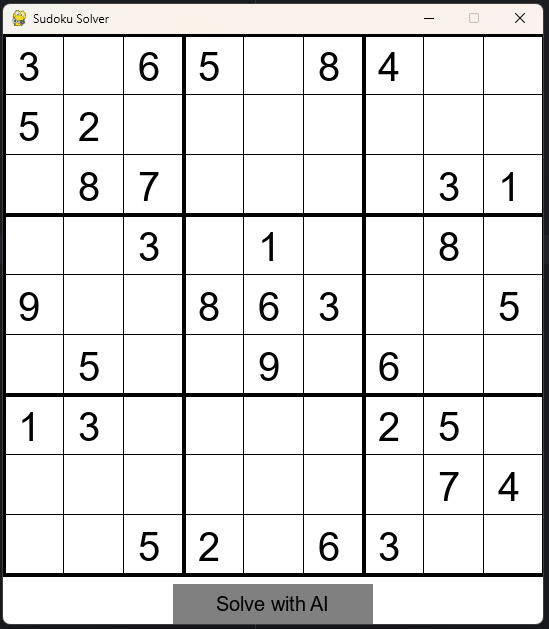
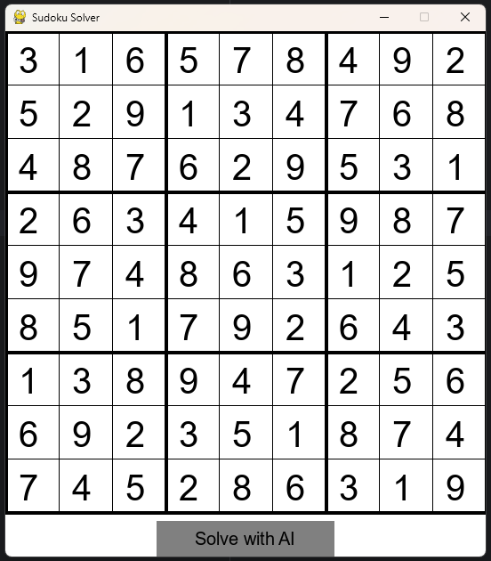
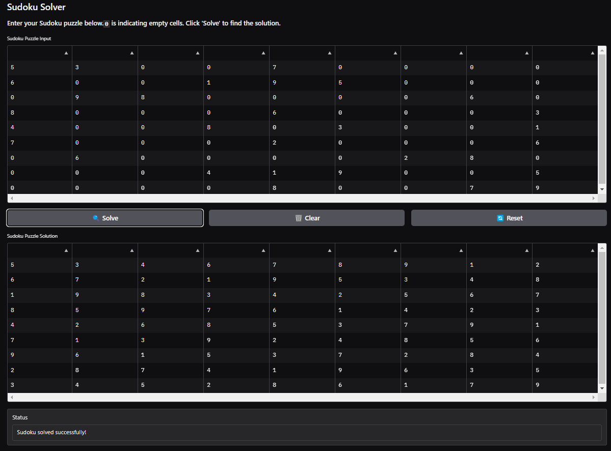

# GameAI
### Logic Puzzle Solver Sudoku 
Sudoku is a logic-based number puzzle played on a 9x9 grid, where each row, column, and 3x3 sub-grid must contain digits 1-9 without repetition, promoting reasoning and problem-solving. 

### How It Works
A Sudoku solver uses backtracking algorithms to fill the grid. It starts by placing a number in an empty cell, then recursively attempts to fill the next cell. If a conflict arises (number repeats in a row, column, or 3x3 sub-grid), it backtracks to the previous cell and tries a different number. This process continues until the grid is correctly filled.


### Constraint Satisfaction Problems (CSP)
The CSP solver uses these steps:
> **Assign a value:** Start by placing a number in an empty cell.

> **Check constraints:** Ensure this number doesn't break any Sudoku rules.

> **Propagate constraints:** Update the possible numbers for other cells based on this assignment.

> **Backtrack if needed:** If a conflict arises, undo the last step and try a different number.


### Pseudocode for backtracking
```
procedure backtrack(P, c) is
    if reject(P, c) then return
    if accept(P, c) then output(P, c)
    s ← first(P, c)
    while s ≠ NULL do
        backtrack(P, s)
        s ← next(P, s)
```

### Output in Pygame





### Output in Gradio(Implement in huggingface) [Gradio](https://huggingface.co/spaces/tono-rashedul/Sudoku-Solver)




## Source
[CSP](https://www.geeksforgeeks.org/constraint-satisfaction-problems-csp-in-artificial-intelligence/)
[CSP Problem](https://medium.com/@co.2020.prkude/formulation-of-csp-problem-sudoku-puzzle-7d5e1d547382)
[Sudoku](https://en.wikipedia.org/wiki/Sudoku)
[Backtrack](https://en.wikipedia.org/wiki/Backtracking)
